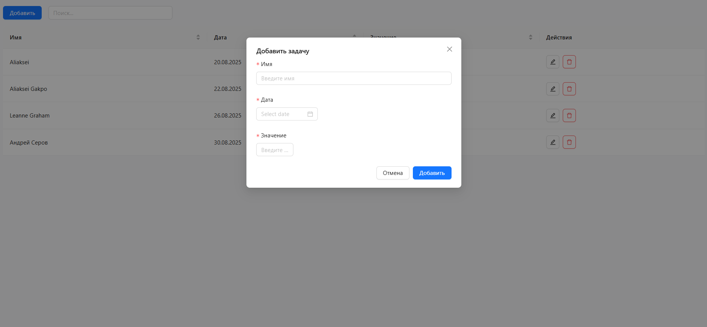

# 📝 Task Manager Table

Приложение для управления задачами с таблицей, модальными формами, сортировкой и поиском.  


---

## 🚀 Демо

👉 [Открыть на GitHub Pages](https://aliakseikrasko.github.io/task_table/)

---

## 🛠️ Технологии

- ⚛️ React + TypeScript
- 🎨 Ant Design (UI-компоненты)
- 📅 dayjs (работа с датами)
- 🔍 lodash (оптимизация поиска и фильтрации)
- 🚀 Vite (сборка и запуск)

---

## ✨ Функциональность

- Таблица с колонками: **имя, дата, значение, действия**
- ✅ Добавление задач через модальное окно
- ✅ Редактирование задачи
- ✅ Удаление задачи
- 🔍 Поиск по всем ячейкам
- 📊 Сортировка по каждому столбцу (учитывает тип данных)
- 🎨 Валидация форм
- 📱 Адаптивный интерфейс

---

## 📸 Скриншоты

### Главный экран


### Модальное окно


---

## ⚙️ Установка и запуск

```bash
# Установка зависимостей
pnpm install

# Запуск dev-сервера
pnpm dev

# Сборка проекта
pnpm build

# Локальный предпросмотр сборки
pnpm preview
```

## 👨‍💻 Автор

- [Aliaksei Krasko](https://github.com/aliakseikrasko)